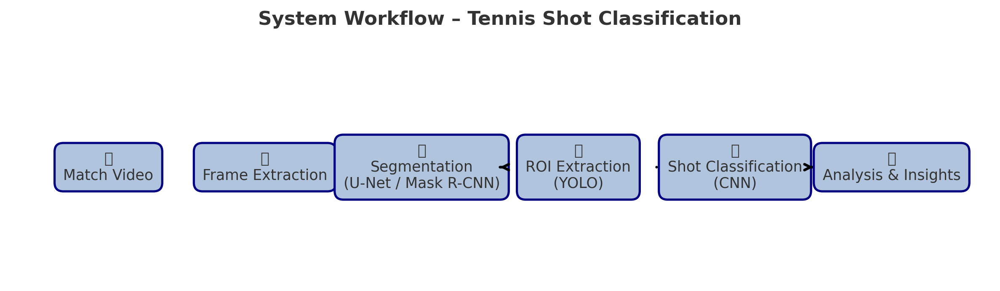
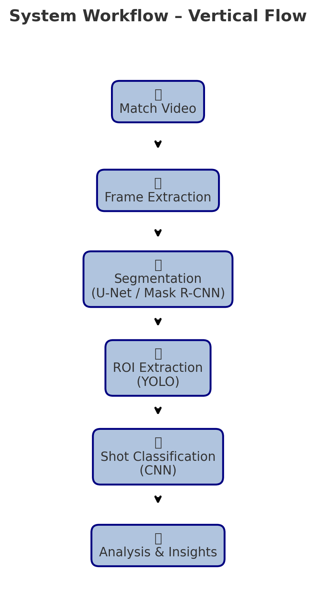
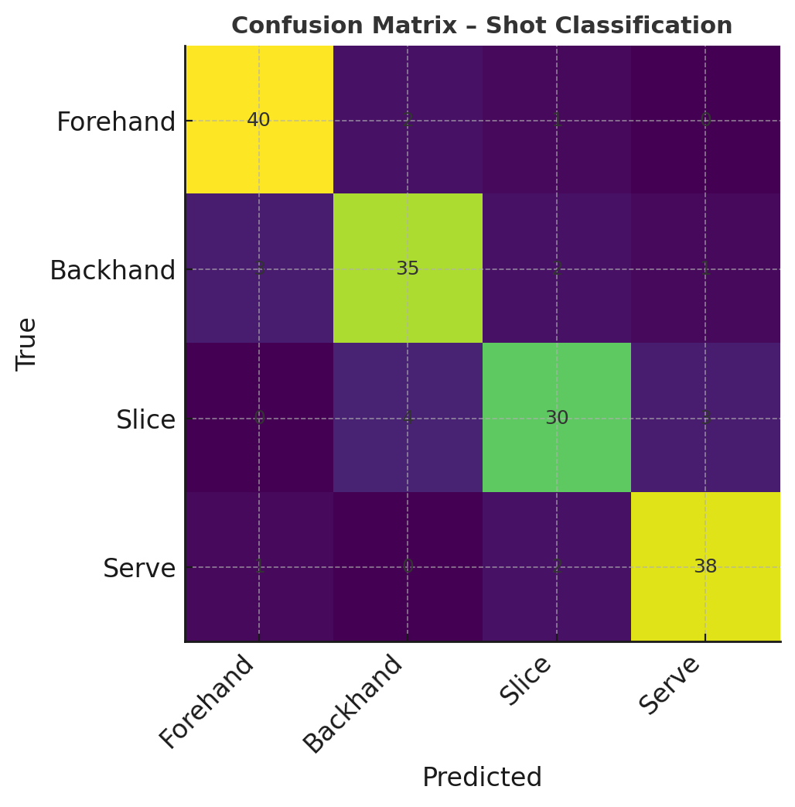
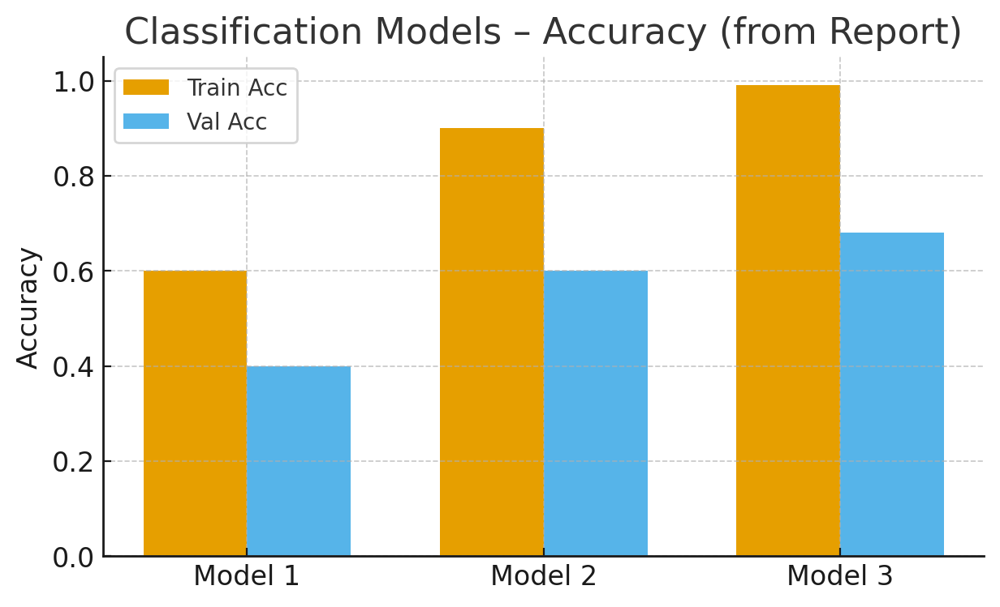
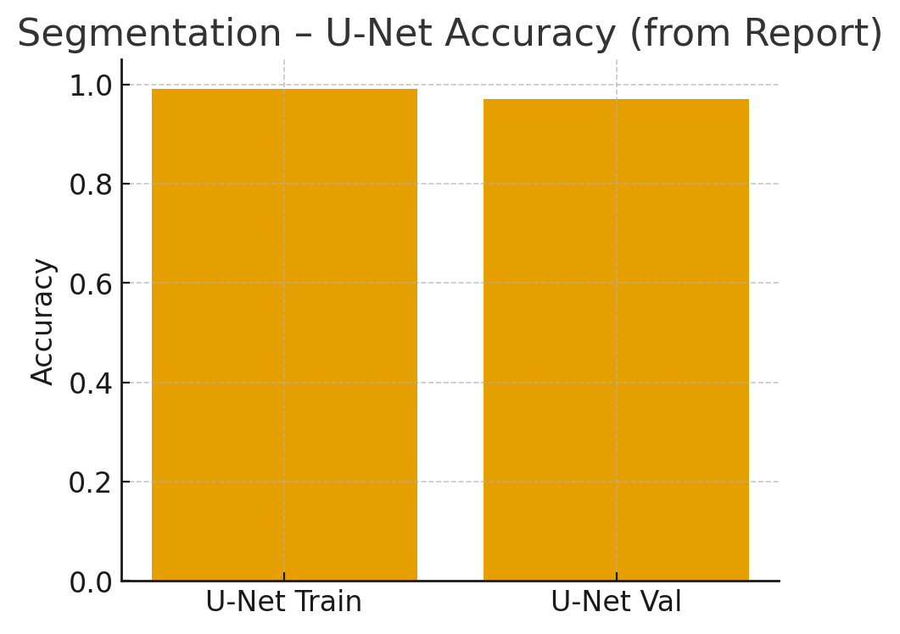
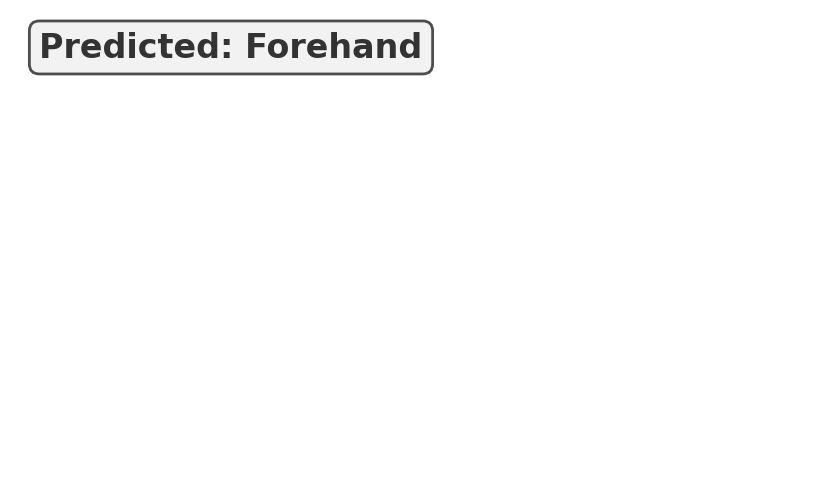

# Professional Tennis Players Shot Classification

## ABSTRACT
This project presents a two-stage deep learning pipeline for tennis analytics. First, a **U-Net** segmentation model isolates players and the court from broadcast frames. Second, a **CNN classifier** identifies the stroke type (**forehand, backhand, slice, serve**) from the segmented region of interest (ROI). Custom datasets were built from **Wimbledon** footage and annotated with **LabelMe**. The system aims to support coaches and analysts with objective insights into player behavior and shot patterns.



## PROBLEM SPACE
Analyzing broadcast tennis footage is challenging due to **occlusion**, **camera motion**, **scale variance**, and **limited labeled data**. Shot types can look visually similar (e.g., backhand vs. slice), and player visibility varies across rallies. We address these challenges via ROI extraction and careful preprocessing.

## AIM OF WORK
1. Build a **segmentation model** to localize players/court elements.
2. Build a **shot classification model** to recognize four stroke types.
3. Provide **visual and quantitative evaluation** suitable for portfolio and research review.
4. Prepare a **reproducible repository** with code, docs, and figures.

## METHODS
- **Data**
  - Broadcast videos split into frames with OpenCV.
  - 200 manually labeled segmentation samples (LabelMe).
  - ~900 player crops for classification across four classes.
- **Segmentation**
  - Model: **U-Net** (4 encoder + 4 decoder blocks).
  - Input size: 224×224; output: binary/semantic masks.
- **ROI Extraction**
  - Bounding boxes from **Mask R-CNN/YOLO** to crop player regions.
- **Classification**
  - CNN with two Conv2D blocks, max-pooling, Flatten, Dense(128), **Dropout(0.6)**, Dense(4, Softmax).
  - Input size: 128×128 RGB.
- **Training**
  - Environment: Google Colab (GPU).
  - Monitoring: TensorBoard, accuracy/loss curves.

### Pipeline (vertical)


## RESULTS

### Best Result Case (Classification)
Confusion matrix demonstrates strongest performance on **forehand** and **serve**, with occasional confusion between **slice** and **backhand**.


### Evaluation
Comparison across three CNN variants (from the thesis). Model 3 (with dropout) yields the best validation accuracy.


### Segmentation Quality
U-Net achieves **~97% validation accuracy** in mask prediction on the custom dataset.


Example segmentation:


### Prediction Overlay
Sample overlay demonstrating the predicted shot on a frame.


## CONCLUSION
A practical pipeline for **tennis shot recognition** and **player segmentation** was implemented and evaluated. Despite limited data, results are promising and demonstrate the feasibility of automated analysis on broadcast footage.

## FUTURE WORK
- Expand and balance the dataset; add data augmentation.
- Extend behavior modeling (attack/defense style, recovery positioning).
- Real-time inference pipeline for live match analytics.
- Integrate dashboards and richer metrics (precision/recall per class).

## HOW TO RUN
1. Create a Python environment and install dependencies:
   ```bash
   pip install -r requirements.txt
   ```
2. Open the notebooks in `notebooks/` to reproduce segmentation and classification experiments.
3. Place sample frames under `data/` following the structure described in the notebooks.

## REPO CONTENTS
- `notebooks/` — training & evaluation notebooks (segmentation, classification, behavior).
- `project_overview.png` — system overview diagram.
- `best_result.png`, `evaluation_table.png`, `HP_table.png` — results figures.
- `segmentation_example.png`, `predicted_shot_overlay.png` — qualitative examples.
- `README.md` — this file.

---
**Author:** Abdelrahman Ahmed Mahmoud Abdelhady
